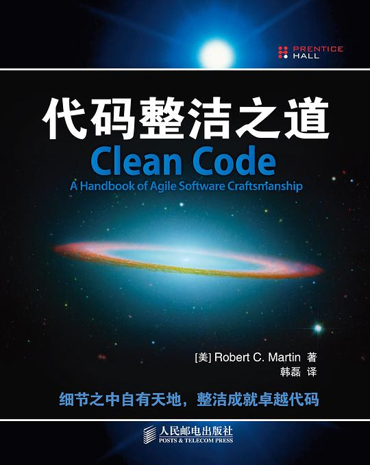

# 代码整洁之道 (javascript 版本)

## 目录

1. 简介
2. 变量
3. 函数
4. 对象和数据结构
5. 类
6. SOLID 和设计模式
7. 测试
8. 并发
9. 错误处理
10. 格式化
11. 注释

## 简介



相信大家对这本 Robert C. Martin 的《代码整洁之道》应该都耳熟能详，但书中所使用的编程语言是 java。本项目所有内容来自于该书，同时用 JavaScript 语言重新进行描述。这不是一个编码风格指南，而是用于指导大家在用 JavaScript 开发时，如何编写有可读性、可复用性和可重构代码的指南。

本文涉及到的所有编码原则都是属于指导性质，并不严格要求大家遵守，但至少能够得到大多数人的认同，毕竟都是行业前辈们多年开发经验汇集而成的。

我们的软件工程技术只有 50 多年的历史，并且仍然保持着高速的发展，这些积累导致我们需要学习很多东西。当软件架构和架构本身一样古老时，也许我们会更难遵循规则。现在，让这些准则作为一个试金石，用来评估您和您团队编写的 JavaScript 代码的质量。

还有一件事情：了解这些编码原则并不会让人成为一个优秀的软件工程师，实际上，即使抱着这些原则从事开发多年仍然避免不了犯错。跟雕塑一样，每一段代码开始的时候会跟湿黏土一样，但是最后，当我们重新回顾的时候，把那些不完美的地方不断凿刻修饰，最终会趋于完善。另外，不要因为最初的代码需要修改就自责，让更好的代码去替代他们才是我们最应该做的事情。

## 变量

### 使用有意义，具备可读性的变量名

**Bad:**

```js
const yyyymmdstr = moment().format('YYYY/MM/DD');
```

**Good:**

```js
const currentDate = moment().format('YYYY/MM/DD');
```

⬆[back to top](#table-of-contents)

### 相同类型的变量要使用一样的单词

**Bad:**

```js
getUserInfo();
getClientData();
getCustomerRecord();
```

**Good:**

```js
getUser();
```

### 使用可检索的命名

我们会读到比写的更多的代码。所以要求我们编写的代码是可读和可检索的。如果不对帮助我们理解程序意义的变量命名，这是对后面工程阅读代码的一种伤害。让我们的变量名可以搜索，并且相关原则的检测可以通过 buddy.js 和 ESLint

**Bad:**

```js
// 这里的 86400000 到底是什么意思？
setTimeout(blastOff, 86400000);
```

```js
// 声明成一个常量，变量名有明确含义，命名方法是全大写，并且用下划线分割
const MILLISECONDS_IN_A_DAY = 86400000;

// 这样是不是好很多，而且具备可读性
setTimeout(blastOff, MILLISECONDS_IN_A_DAY);
```

### 使用自解释的变量名

**Bad:**

```js
const address = 'One Infinite Loop, Cupertino 95014';
const cityZipCodeRegex = /^[^,\\]+[,\\\s]+(.+?)\s*(\d{5})?$/;
saveCityZipCode(
  address.match(cityZipCodeRegex)[1],
  address.match(cityZipCodeRegex)[2]
);
```

**Good:**

```js
const address = 'One Infinite Loop, Cupertino 95014';
const cityZipCodeRegex = /^[^,\\]+[,\\\s]+(.+?)\s*(\d{5})?$/;
const [_, city, zipCode] = address.match(cityZipCodeRegex) || [];
saveCityZipCode(city, zipCode);
```

### 避免映射心理

显示的说明要比隐式的更好

**Bad:**

```js
const locations = ['Austin', 'New York', 'San Francisco'];
locations.forEach((l) => {
  doStuff();
  doSomeOtherStuff();
  // ...
  // ...
  // ...
  // 较长的逻辑处理之后，已经不太能理解这个 l 是什么意思
  dispatch(l);
});
```

**Good:**

```js
const locations = ['Austin', 'New York', 'San Francisco'];
locations.forEach((location) => {
  doStuff();
  doSomeOtherStuff();
  // ...
  // ...
  // ...
  dispatch(location);
});
```

tip: 这个原则涉及的场景经常是我们在使用遍历或者管道函数处理数据的时候遇到。

### 不要添加不需要的上下文

如果我们在声明**对象/类**已经明确了语义，那就不要在**属性/成员变量**中重复声明了

**Bad:**

```js
const Car = {
  carMake: 'Honda',
  carModel: 'Accord',
  carColor: 'Blue',
};

function paintCar(car) {
  car.carColor = 'Red';
}
```

**Good:**

```js
const Car = {
  make: 'Honda',
  model: 'Accord',
  color: 'Blue',
};

function paintCar(car) {
  car.color = 'Red';
}
```

### 使用默认参数替代短路语句或者条件判断

默认参数看起来要比短路更加简洁。但是有一点要注意，如果使用默认参数，函数将只给未定义的参数提供默认值，其他假值 （如“”、“”、false、null、0 和 NaN）将不会被默认值替换

**Bad:**

```js
function createMicrobrewery(name) {
  const breweryName = name || 'Hipster Brew Co.';
  // ...
}
```

**Good:**

```js
function createMicrobrewery(name = 'Hipster Brew Co.') {
  // ...
}
```
